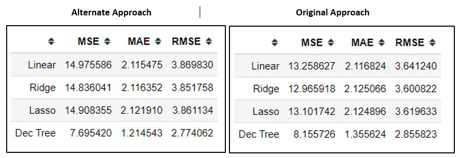

# Fare Prediction
**Analysis of Taxi Fare Rates**

The dataset provided pertains to fares of taxi-rides for a particular locale and this notebook aims to use the dataset to train a machine learning model and predict the taxi-fare rates based on this model.

**Target:** fare amount (inclusive of tolls) for a taxi ride.

The description of all the attributes is given in **Attributes_Description.docx** file in the repository. 

The **Fare_Prediction.ipynb** notebook mentions the approach taken, all the individual steps right from data cleaning to model building to making predictions and also contains references to validate it's use of several formulae (for distance calculation and such). The eventual summary of error metrics for different models after doing the analysis is as follows:

**Best Model:** Decision Trees

**Least RMSE:** 2.77 Currency Units through alternate approach

**References:**

1. https://en.wikipedia.org/wiki/Geographical_distance

2. https://www.quora.com/What-does-negative-longitude-mean

3. https://www.movable-type.co.uk/scripts/latlong.html

4. https://gearpatrol.com/2019/09/08/bugatti-just-shattered-a-record-to-become-the-fastest-car-in-the-world/
